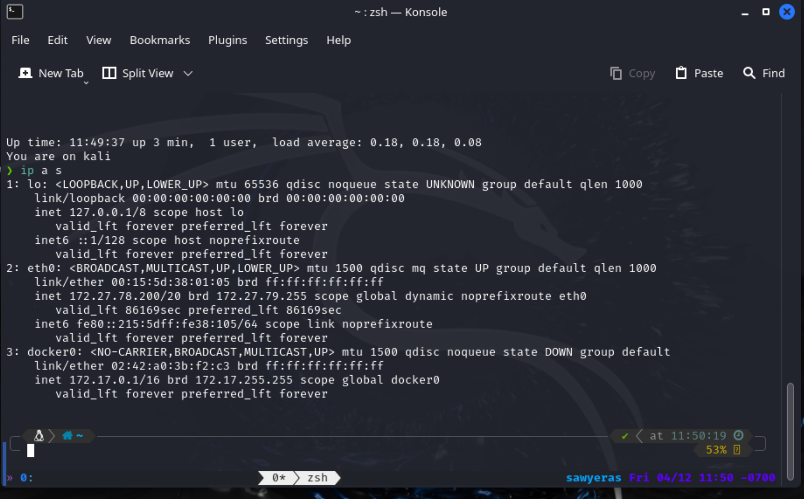
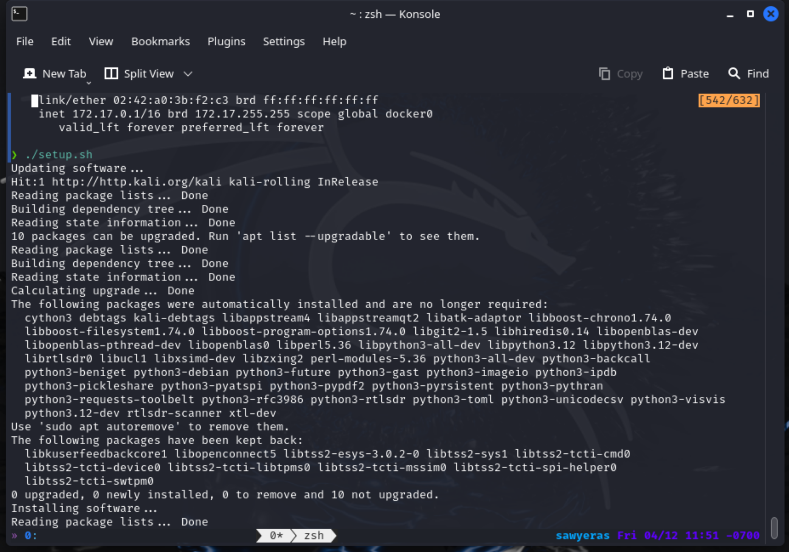
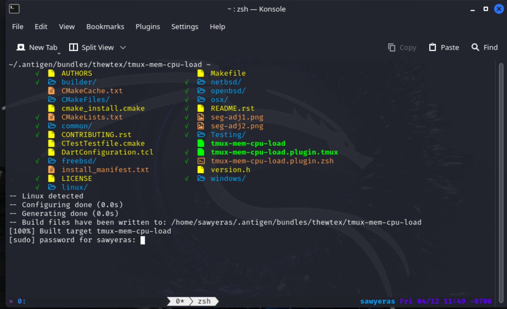
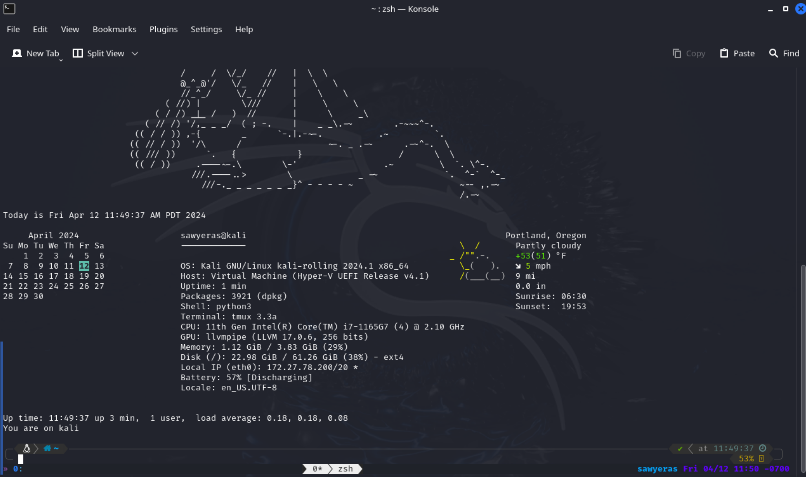

# Creating the VM
I already had Hyper-V ready to go, so I went straight to getting the image. 

```ps
 > Invoke-WebRequest -Uri "https://kali.darklab.sh/kali-images/kali-2023.4/kali-linux-2023.4-installer-amd64.iso" -OutFile "kali-linux-2023.4-installer-amd64.iso"
 > Get-FileHash -Algorithm SHA512 -Path .kali-linux-2023.4-installer-amd64.iso | Format-List

Algorithm : SHA512
Hash      : 0B9BB5B2121533AD37E4E35C17012C89634FB66F45E5B268EA69D85CD6EA6F685C19D9C2B11AE0D6125BC66AD63BE76D6B7AD3F7F26
            770BAD392003366690FAE
Path      : C:\Users\ashto\Desktop\kali-linux-2023.4-installer-amd64.iso
```

I made a Gen. 2 VM named `netsec-kali` with 4096 MB startup memory and 64 GB hard drive that 
uses the default switch to connect to the network, then I disabled secure boot. 

# Setting up the VM
I ran `setup.sh` and rebooted the VM, then ran the script to enable Enhanced Session Mode from
the VM side and rebooted again. Then I enabled ESM from the host side.

```ps
 > Set-VM -VMName netsec-kali -EnhancedSessionTransportType HvSocket
```

# Screenshots
## ip a s


## setup.sh
When I re-run `setup.sh` the output doens't all fit on one screen, but it's just a bunch of output saying
that the packages have already been installed. 



## Weird stuff
When I first open a new shell I have to input my `sudo` password, but then once I input it, everything seems to 
show up as intended. 




