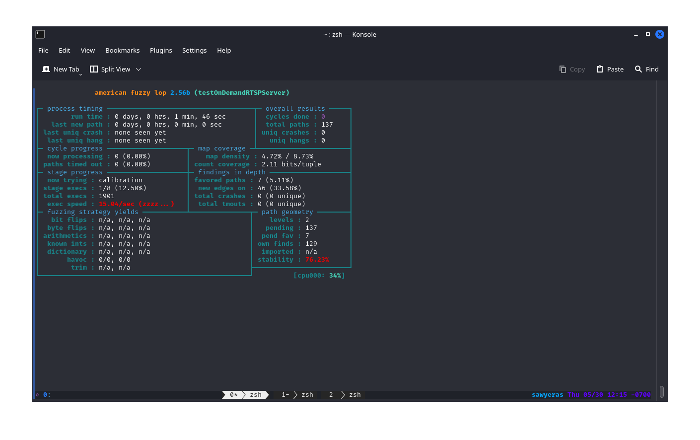

# Docker
I used the docker file that was provided in the homework:

```Dockerfile
# syntax=docker/dockerfile-upstream:master-labs
FROM ubuntu:18.04

RUN apt-get -y update && \
    apt-get -y install sudo \
    apt-utils \
    build-essential \
    openssl \
    clang \
    graphviz-dev \
    git \
    libcap-dev

# Download and compile AFLNet
ENV LLVM_CONFIG="llvm-config-6.0"


RUN git clone https://github.com/aflnet/aflnet.git /opt/aflnet && cd /opt/aflnet && make clean all && cd llvm_mode && make
#WORKDIR /opt/aflnet

# Set up environment variables for AFLNet
ENV AFLNET="/opt/aflnet"
ENV PATH="${PATH}:${AFLNET}"
ENV AFL_PATH="${AFLNET}"
ENV AFL_I_DONT_CARE_ABOUT_MISSING_CRASHES=1 \
    AFL_SKIP_CPUFREQ=1
ENV WORKDIR="/home/testing"

RUN mkdir -p /home/testing/
RUN cd $WORKDIR && \
        git clone https://github.com/rgaufman/live555.git && \
        cd live555 && \
        git checkout ceeb4f4 && \
        patch -p1 < $AFLNET/tutorials/live555/ceeb4f4_states_decomposed.patch && \
        ./genMakefiles linux && \
        make clean all
```

## Building + Running
```
 $ docker build . --tag aflnet
permission denied while trying to connect to the Docker daemon socket at unix:///var/run/docker.sock: Post "http://%2Fvar%2Frun%2Fdocker.sock/v1.24/build?buildargs=%7B%7D&cachefrom=%5B%5D&cgroupparent=&cpuperiod=0&cpuquota=0&cpusetcpus=&cpusetmems=&cpushares=0&dockerfile=Dockerfile&labels=%7B%7D&memory=0&memswap=0&networkmode=default&rm=1&shmsize=0&t=aflnet&target=&ulimits=null&version=1": dial unix /var/run/docker.sock: connect: permission denied
 
 $ sudo docker build . --tag aflnet
Sending build context to Docker daemon  1.555GB
Step 1/11 : FROM ubuntu:18.04
18.04: Pulling from library/ubuntu
7c457f213c76: Pull complete
Digest: sha256:152dc042452c496007f07ca9127571cb9c29697f42acbfad72324b2bb2e43c98
...
Successfully built 3fd8995ca5a3
Successfully tagged aflnet:latest

 $ sudo docker run -it aflnet
root@34ee24d8d793:/#
```

# Exercise 1
## Live555
I didn't really have to patch and remake live555 because that was already done in the 
dockerfile, but I didn't notice that until I'd already done it. 

```
 > cd $WORKDIR
 > git clone https://github.com/rgaufman/live555.git
fatal: destination path 'live555' already exists and is not an empty directory.

 > cd live555
 > git checkout ceeb4f4
M       Makefile
M       config.linux
M       liveMedia/GenericMediaServer.cpp
M       liveMedia/RTSPServer.cpp
M       testProgs/testOnDemandRTSPServer.cpp
HEAD is now at ceeb4f4 Bump to version 2018.08.28
 
 > patch -p1 < $AFLNET/tutorials/live555/ceeb4f4.patch
patching file config.linux
Reversed (or previously applied) patch detected!  Assume -R? [n] y
patching file liveMedia/GenericMediaServer.cpp
Reversed (or previously applied) patch detected!  Assume -R? [n] y
patching file testProgs/testOnDemandRTSPServer.cpp
Reversed (or previously applied) patch detected!  Assume -R? [n] y

 > ./genMakefiles linux
 > make clean all
cd liveMedia ; make clean
make[1]: Entering directory '/home/testing/live555/liveMedia'
rm -rf *.o libliveMedia.a core *.core *~ include/*~
...

 > ls testProgs | grep "testOnDemandRTSP\|testRTSP"
testOnDemandRTSPServer
testOnDemandRTSPServer.cpp
testOnDemandRTSPServer.cpp.orig
testOnDemandRTSPServer.o
testRTSPClient
testRTSPClient.cpp
testRTSPClient.o

 > cd testProgs
 > cp $AFLNET/tutorials/live555/sample_media_sources/*.* ./
```

## Getting the Seeds
```
 > ./testOnDemandRTSPServer 8554
...

"wavAudioTest" stream, from the file "test.wav"
Play this stream using the URL "rtsp://172.17.0.2:8554/wavAudioTest"

...

 > sudo tcpdump -w rtsp.pcap -i lo port 8554
tcpdump: listening on lo, link-type EN10MB (Ethernet), capture size 262144 bytes

 > ./testRTSPClient rtsp://172.17.0.2:8554/wavAudioTest
Created new TCP socket 3 for connection
Connecting to 172.17.0.2, port 8554 on socket 3...
...remote connection opened
Sending request: DESCRIBE rtsp://172.17.0.2:8554/wavAudioTest RTSP/1.0
CSeq: 2
User-Agent: ./testRTSPClient (LIVE555 Streaming Media v2018.08.28)
Accept: application/sdp


Received 544 new bytes of response data.
Received a complete DESCRIBE response:
RTSP/1.0 200 OK

...

[URL:"rtsp://172.17.0.2:8554/wavAudioTest/"]: Initiated the "audio/L16" subsession (client ports 52264-52265)
Sending request: SETUP rtsp://172.17.0.2:8554/wavAudioTest/track1 RTSP/1.0
CSeq: 3
User-Agent: ./testRTSPClient (LIVE555 Streaming Media v2018.08.28)
Transport: RTP/AVP;unicast;client_port=52264-52265


Received 210 new bytes of response data.
Received a complete SETUP response:
RTSP/1.0 201 OK
CSeq: 3
Date: Thu, May 30 2024 18:26:11 GMT
Transport: RTP/AVP;unicast;destination=172.17.0.2;source=172.17.0.2;client_port=52264-52265;server_port=6972-6973
Session: DA1F3B26;timeout=65


[URL:"rtsp://172.17.0.2:8554/wavAudioTest/"]: Failed to set up the "audio/L16" subsession: 201 OK
[URL:"rtsp://172.17.0.2:8554/wavAudioTest/"]: Failed to start playing session: No RTSP session is currently in progress

[URL:"rtsp://172.17.0.2:8554/wavAudioTest/"]: Closing the stream.
```

Because the subsession wasn't set up correctly, I was only able to capture two of the four requests, so I 
grabbed the [data in the repo](https://raw.githubusercontent.com/aflnet/aflnet/master/tutorials/live555/in-rtsp/rtsp_requests_wav.raw)

```
 > afl-fuzz -d -i $AFLNET/tutorials/live555/in-rtsp/ -o out-live555 -N tcp://127.0.0.1/8554 -x $AFLNET/tutorials/live555/rtsp.dict -P RTSP -D 10000 -q 3 -s 3 -E -K -R ./testOnDemandRTSPServer 8554
afl-fuzz 2.56b by <lcamtuf@google.com>
[+] You have 8 CPU cores and 3 runnable tasks (utilization: 38%).
[+] Try parallel jobs - see docs/parallel_fuzzing.txt.
[*] Checking CPU core loadout...
[+] Found a free CPU core, binding to #0.
[*] Checking core_pattern...

[-] Hmm, your system is configured to send core dump notifications to an
    external utility. This will cause issues: there will be an extended delay
    between stumbling upon a crash and having this information relayed to the
    fuzzer via the standard waitpid() API.

    To avoid having crashes misinterpreted as timeouts, please log in as root
    and temporarily modify /proc/sys/kernel/core_pattern, like so:

    echo core >/proc/sys/kernel/core_pattern
[*] Setting up output directories...
[*] Scanning '/opt/aflnet/tutorials/live555/in-rtsp/'...
[+] No auto-generated dictionary tokens to reuse.
[*] Creating hard links for all input files...
[*] Loading extra dictionary from '/opt/aflnet/tutorials/live555/rtsp.dict' (level 0)...
[+] Loaded 24 extra tokens, size range 3 B to 16 B.
[*] Validating target binary...

[-] Looks like the target binary is not instrumented! The fuzzer depends on
    compile-time instrumentation to isolate interesting test cases while
    mutating the input data. For more information, and for tips on how to
    instrument binaries, please see docs/README.

    When source code is not available, you may be able to leverage QEMU
    mode support. Consult the README for tips on how to enable this.
    (It is also possible to use afl-fuzz as a traditional, "dumb" fuzzer.
    For that, you can use the -n option - but expect much worse results.)

[-] PROGRAM ABORT : No instrumentation detected
         Location : check_binary(), afl-fuzz.c:7950
```

I don't know what exactly happened... but I recompiled everything and was able to get it running. 
I tried to fix the core dump problem, but it kept complaining about it being a read-only filesystem. 
So I just ignored it. 


