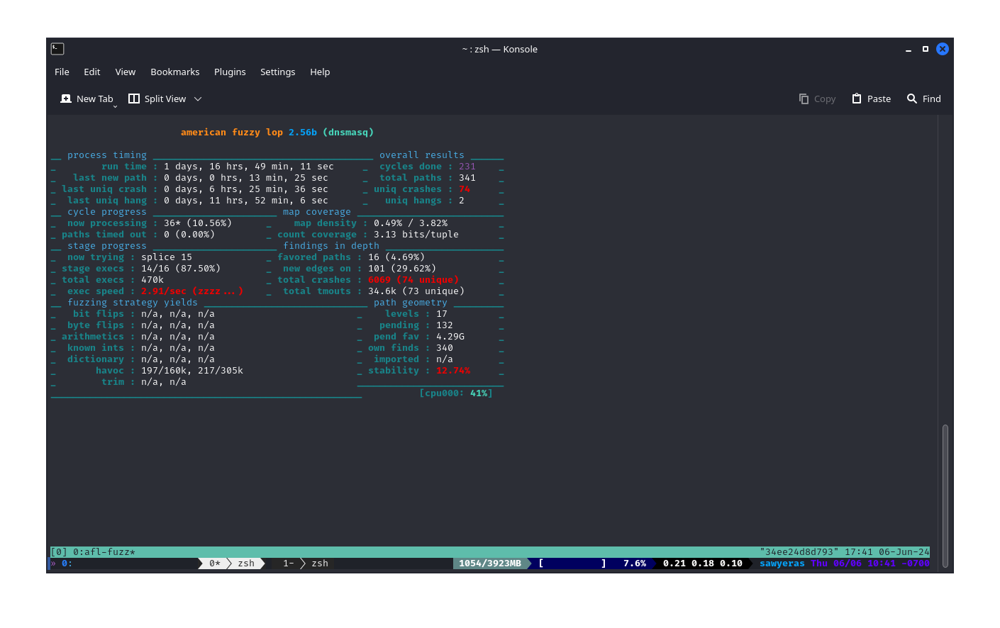
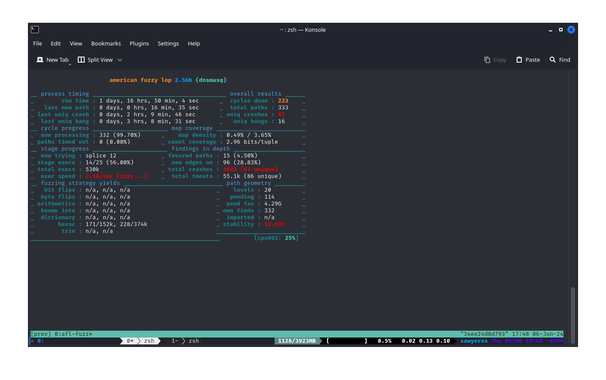

[[_TOC_]]

# Docker
I used the docker file that was provided in the homework:

```Dockerfile
# syntax=docker/dockerfile-upstream:master-labs
FROM ubuntu:18.04

RUN apt-get -y update && \
    apt-get -y install sudo \
    apt-utils \
    build-essential \
    openssl \
    clang \
    graphviz-dev \
    git \
    libcap-dev

# Download and compile AFLNet
ENV LLVM_CONFIG="llvm-config-6.0"


RUN git clone https://github.com/aflnet/aflnet.git /opt/aflnet && cd /opt/aflnet && make clean all && cd llvm_mode && make
#WORKDIR /opt/aflnet

# Set up environment variables for AFLNet
ENV AFLNET="/opt/aflnet"
ENV PATH="${PATH}:${AFLNET}"
ENV AFL_PATH="${AFLNET}"
ENV AFL_I_DONT_CARE_ABOUT_MISSING_CRASHES=1 \
    AFL_SKIP_CPUFREQ=1
ENV WORKDIR="/home/testing"

RUN mkdir -p /home/testing/
RUN cd $WORKDIR && \
        git clone https://github.com/rgaufman/live555.git && \
        cd live555 && \
        git checkout ceeb4f4 && \
        patch -p1 < $AFLNET/tutorials/live555/ceeb4f4_states_decomposed.patch && \
        ./genMakefiles linux && \
        make clean all
```

## Building + Running
```
 $ docker build . --tag aflnet
permission denied while trying to connect to the Docker daemon socket at unix:///var/run/docker.sock: Post "http://%2Fvar%2Frun%2Fdocker.sock/v1.24/build?buildargs=%7B%7D&cachefrom=%5B%5D&cgroupparent=&cpuperiod=0&cpuquota=0&cpusetcpus=&cpusetmems=&cpushares=0&dockerfile=Dockerfile&labels=%7B%7D&memory=0&memswap=0&networkmode=default&rm=1&shmsize=0&t=aflnet&target=&ulimits=null&version=1": dial unix /var/run/docker.sock: connect: permission denied
 
 $ sudo docker build . --tag aflnet
Sending build context to Docker daemon  1.555GB
Step 1/11 : FROM ubuntu:18.04
18.04: Pulling from library/ubuntu
7c457f213c76: Pull complete
Digest: sha256:152dc042452c496007f07ca9127571cb9c29697f42acbfad72324b2bb2e43c98
...
Successfully built 3fd8995ca5a3
Successfully tagged aflnet:latest

 $ sudo docker run -it aflnet
root@34ee24d8d793:/#
```

# Exercise 1 - Live555
## Patching
I didn't really have to patch and remake live555 because that was already done in the 
dockerfile, but I didn't notice that until I'd already done it. 

```
 > cd $WORKDIR
 > git clone https://github.com/rgaufman/live555.git
fatal: destination path 'live555' already exists and is not an empty directory.

 > cd live555
 > git checkout ceeb4f4
M       Makefile
M       config.linux
M       liveMedia/GenericMediaServer.cpp
M       liveMedia/RTSPServer.cpp
M       testProgs/testOnDemandRTSPServer.cpp
HEAD is now at ceeb4f4 Bump to version 2018.08.28
 
 > patch -p1 < $AFLNET/tutorials/live555/ceeb4f4.patch
patching file config.linux
Reversed (or previously applied) patch detected!  Assume -R? [n] y
patching file liveMedia/GenericMediaServer.cpp
Reversed (or previously applied) patch detected!  Assume -R? [n] y
patching file testProgs/testOnDemandRTSPServer.cpp
Reversed (or previously applied) patch detected!  Assume -R? [n] y

 > ./genMakefiles linux
 > make clean all
cd liveMedia ; make clean
make[1]: Entering directory '/home/testing/live555/liveMedia'
rm -rf *.o libliveMedia.a core *.core *~ include/*~
...

 > ls testProgs | grep "testOnDemandRTSP\|testRTSP"
testOnDemandRTSPServer
testOnDemandRTSPServer.cpp
testOnDemandRTSPServer.cpp.orig
testOnDemandRTSPServer.o
testRTSPClient
testRTSPClient.cpp
testRTSPClient.o

 > cd testProgs
 > cp $AFLNET/tutorials/live555/sample_media_sources/*.* ./
```

## Getting the Seeds
```
 > ./testOnDemandRTSPServer 8554
...

"wavAudioTest" stream, from the file "test.wav"
Play this stream using the URL "rtsp://172.17.0.2:8554/wavAudioTest"

...

 > sudo tcpdump -w rtsp.pcap -i lo port 8554
tcpdump: listening on lo, link-type EN10MB (Ethernet), capture size 262144 bytes

 > ./testRTSPClient rtsp://172.17.0.2:8554/wavAudioTest
Created new TCP socket 3 for connection
Connecting to 172.17.0.2, port 8554 on socket 3...
...remote connection opened
Sending request: DESCRIBE rtsp://172.17.0.2:8554/wavAudioTest RTSP/1.0
CSeq: 2
User-Agent: ./testRTSPClient (LIVE555 Streaming Media v2018.08.28)
Accept: application/sdp


Received 544 new bytes of response data.
Received a complete DESCRIBE response:
RTSP/1.0 200 OK

...

[URL:"rtsp://172.17.0.2:8554/wavAudioTest/"]: Initiated the "audio/L16" subsession (client ports 52264-52265)
Sending request: SETUP rtsp://172.17.0.2:8554/wavAudioTest/track1 RTSP/1.0
CSeq: 3
User-Agent: ./testRTSPClient (LIVE555 Streaming Media v2018.08.28)
Transport: RTP/AVP;unicast;client_port=52264-52265


Received 210 new bytes of response data.
Received a complete SETUP response:
RTSP/1.0 201 OK
CSeq: 3
Date: Thu, May 30 2024 18:26:11 GMT
Transport: RTP/AVP;unicast;destination=172.17.0.2;source=172.17.0.2;client_port=52264-52265;server_port=6972-6973
Session: DA1F3B26;timeout=65


[URL:"rtsp://172.17.0.2:8554/wavAudioTest/"]: Failed to set up the "audio/L16" subsession: 201 OK
[URL:"rtsp://172.17.0.2:8554/wavAudioTest/"]: Failed to start playing session: No RTSP session is currently in progress

[URL:"rtsp://172.17.0.2:8554/wavAudioTest/"]: Closing the stream.
```

Because the subsession wasn't set up correctly, I was only able to capture two of the four requests, so I 
grabbed the [data in the repo](https://raw.githubusercontent.com/aflnet/aflnet/master/tutorials/live555/in-rtsp/rtsp_requests_wav.raw)

## Fuzzing

```
 > afl-fuzz -d -i $AFLNET/tutorials/live555/in-rtsp/ -o out-live555 -N tcp://127.0.0.1/8554 -x $AFLNET/tutorials/live555/rtsp.dict -P RTSP -D 10000 -q 3 -s 3 -E -K -R ./testOnDemandRTSPServer 8554
afl-fuzz 2.56b by <lcamtuf@google.com>
[+] You have 8 CPU cores and 3 runnable tasks (utilization: 38%).
[+] Try parallel jobs - see docs/parallel_fuzzing.txt.
[*] Checking CPU core loadout...
[+] Found a free CPU core, binding to #0.
[*] Checking core_pattern...

[-] Hmm, your system is configured to send core dump notifications to an
    external utility. This will cause issues: there will be an extended delay
    between stumbling upon a crash and having this information relayed to the
    fuzzer via the standard waitpid() API.

    To avoid having crashes misinterpreted as timeouts, please log in as root
    and temporarily modify /proc/sys/kernel/core_pattern, like so:

    echo core >/proc/sys/kernel/core_pattern
[*] Setting up output directories...
[*] Scanning '/opt/aflnet/tutorials/live555/in-rtsp/'...
[+] No auto-generated dictionary tokens to reuse.
[*] Creating hard links for all input files...
[*] Loading extra dictionary from '/opt/aflnet/tutorials/live555/rtsp.dict' (level 0)...
[+] Loaded 24 extra tokens, size range 3 B to 16 B.
[*] Validating target binary...

[-] Looks like the target binary is not instrumented! The fuzzer depends on
    compile-time instrumentation to isolate interesting test cases while
    mutating the input data. For more information, and for tips on how to
    instrument binaries, please see docs/README.

    When source code is not available, you may be able to leverage QEMU
    mode support. Consult the README for tips on how to enable this.
    (It is also possible to use afl-fuzz as a traditional, "dumb" fuzzer.
    For that, you can use the -n option - but expect much worse results.)

[-] PROGRAM ABORT : No instrumentation detected
         Location : check_binary(), afl-fuzz.c:7950
```

I don't know what exactly happened... but I recompiled everything and was able to get it running. 
I tried to fix the core dump problem, but it kept complaining about it being a read-only filesystem. 
So I just ignored it. 


```
 > cat out-live555/fuzzer_stats
start_time        : 1717096405
last_update       : 1717111739
fuzzer_pid        : 1029
cycles_done       : 124
execs_done        : 170483
execs_per_sec     : 11.08
paths_total       : 980
paths_favored     : 51
paths_found       : 973
paths_imported    : 0
max_depth         : 8
cur_path          : 959
pending_favs      : 0
pending_total     : 764
variable_paths    : 901
stability         : 26.97%
bitmap_cvg        : 9.42%
unique_crashes    : 47
unique_hangs      : 0
last_path         : 1717111691
last_crash        : 1717111189
last_hang         : 0
execs_since_crash : 5395
exec_timeout      : 120
afl_banner        : testOnDemandRTSPServer
afl_version       : 2.56b
target_mode       : default
command_line      : afl-fuzz -d -i /opt/aflnet/tutorials/live555/in-rtsp/ -o out-live555 -N tcp://127.0.0.1/8554 -x /opt/aflnet/tutorials/live555/rtsp.dict -P RTSP -D 10000 -q 3 -s 3 -E -K -R ./testOnDemandRTSPServer 8554
slowest_exec_ms   : 0
peak_rss_mb       : 7
```

## Replay
```
 > ./testOnDemandRTSPServer 8554                    | > aflnet-replay $AFLNET/tutorials/live555/CVE_2019_7314.poc RTSP 8554
                                                    |
                                                    |Size of the current packet 1 is  97
                                                    |
                                                    |Size of the current packet 2 is  20000
                                                    |
                                                    |--------------------------------
                                                    |Responses from server:0-201-
                                                    |++++++++++++++++++++++++++++++++
...                                                 |Responses in details:
                                                    |RTSP/1.0 201 OK
                                                    |CSeq: 3^M
                                                    |Date: Thu, May 30 2024 23:39:41 GMT
                                                    |Transport: RTP/AVP/TCP;unicast;destination=127.0.0.1;source=127.0.0.1;interleaved=0-1
                                                    |Session: 000022B8;timeout=65
                                                    |
                                                    |$4Uz{V47Uz
                                                    |          34ee24d8d793$
                                                    |48Uz.45
                                                    |-------------------------------->
Segmentation fault (core dumped)                    |
```

# Exercise 2 - Dnsmasq
## Setup
I created this script from the tutorial and ran it. 

```bash

# clone + cd into the repo
git clone git://thekelleys.org.uk/dnsmasq.git
cd dnsmasq

# checkout the correct version
git checkout v2.73rc6

# compile
CC=$AFLNET/afl-clang-fast make

# copy the config file
sudo cp $AFLNET/tutorials/dnsmasq/dnsmasq.conf /etc/

# move to the correct directory
cd src/
```

### Testing 
```
 > echo address=/test.com/5.5.5.5 | sudo tee -a /etc/dnsmasq.conf
address=/test.com/5.5.5.5
 >  ./dnsmasq
dnsmasq: started, version 2.73rc6 cachesize 150
dnsmasq: compile time options: IPv6 GNU-getopt no-DBus no-i18n no-IDN DHCP DHCPv6 no-Lua TFTP no-conntrack ipset auth no-DNSSEC loop-detect inotify
dnsmasq: cleared cache

 > dig @127.0.0.1 -p 5353 test.com

; <<>> DiG 9.11.3-1ubuntu1.18-Ubuntu <<>> @127.0.0.1 -p 5353 test.com
; (1 server found)
;; global options: +cmd
;; Got answer:
;; ->>HEADER<<- opcode: QUERY, status: NOERROR, id: 15677
;; flags: qr aa rd ra ad; QUERY: 1, ANSWER: 1, AUTHORITY: 0, ADDITIONAL: 0

;; QUESTION SECTION:
;test.com.                      IN      A

;; ANSWER SECTION:
test.com.               0       IN      A       5.5.5.5

;; Query time: 0 msec
;; SERVER: 127.0.0.1#5353(127.0.0.1)
;; WHEN: Tue Jun 04 19:05:23 UTC 2024
;; MSG SIZE  rcvd: 42

```

## Getting seeds
Because the packets to dnsmasq were MDNS packets, I also got some normal DNS packets that were sent to my
default server. 

```
 > sudo tcpdump -w dns.pcap 
tcpdump: listening on eth0, link-type EN10MB (Ethernet), capture size 262144 bytes

 > dig google.com
 > dig google.com NS

 > sudo tcpdump -w dns1.pcap -i lo 
tcpdump: listening on lo, link-type EN10MB (Ethernet), capture size 262144 bytes

 > dig @127.0.0.1 -p 5353 test.com
 > dig @127.0.0.1 -p 5353 -x 142.251.211.238

```

I opened `dns.pcap` and `dns1.pcap` in Wireshark and exported the requests from each UDP stream into its own file,
then put them all together with `cat dns*.raw > dns.raw`.

```
 $ xxd dns.raw
00000000: e469 0120 0001 0000 0000 0001 0667 6f6f  .i. .........goo
00000010: 676c 6503 636f 6d00 0002 0001 0000 2910  gle.com.......).
00000020: 0000 0000 0000 0c00 0a00 08ba b0ae 6ed1  ..............n.
00000030: a78d 6bbe 0b01 2000 0100 0000 0000 0106  ..k... .........
00000040: 676f 6f67 6c65 0363 6f6d 0000 0100 0100  google.com......
00000050: 0029 1000 0000 0000 000c 000a 0008 6377  .)............cw
00000060: 88b8 fb4e 7dec f942 0120 0001 0000 0000  ...N}..B. ......
00000070: 0001 0474 6573 7403 636f 6d00 0001 0001  ...test.com.....
00000080: 0000 2910 0000 0000 0000 0c00 0a00 083f  ..)............?
00000090: 9eaf de17 3709 404e 1901 2000 0100 0000  ....7.@N.. .....
000000a0: 0000 0103 3233 3803 3231 3103 3235 3103  ....238.211.251.
000000b0: 3134 3207 696e 2d61 6464 7204 6172 7061  142.in-addr.arpa
000000c0: 0000 0c00 0100 0029 1000 0000 0000 000c  .......)........
000000d0: 000a 0008 06ea 1d4e f4b9 17a2 1032 0100  .......N.....2..
000000e0: 0001 0000 0000 0000 0667 6f6f 676c 6503  .........google.
000000f0: 636f 6d00 0010 0001 f76f 0100 0001 0000  com......o......
00000100: 0000 0000 0667 6f6f 676c 6503 636f 6d00  .....google.com.
00000110: 000f 0001 49a1 0100 0001 0000 0000 0000  ....I...........
00000120: 0667 6f6f 676c 6503 636f 6d00 001d 0001  .google.com.....
00000130: 9bbb 0100 0001 0000 0000 0000 0331 3034  .............104
00000140: 0139 0331 3932 0236 3607 696e 2d61 6464  .9.192.66.in-add
00000150: 7204 6172 7061 0000 0c00 0175 c001 0000  r.arpa.....u....
00000160: 0100 0000 0000 0003 7777 7706 6e65 7462  ........www.netb
00000170: 7364 036f 7267 0000 0100 01f0 d401 0000  sd.org..........
00000180: 0100 0000 0000 0003 7777 7706 6e65 7462  ........www.netb
00000190: 7364 036f 7267 0000 1c00 01fe e301 0000  sd.org..........
000001a0: 0100 0000 0000 0003 7777 7703 6973 6303  ........www.isc.
000001b0: 6f72 6700 00ff 0001 208a 0100 0001 0000  org..... .......
000001c0: 0000 0000 0369 7363 036f 7267 0000 0200  .....isc.org....
000001d0: 01f1 6101 0000 0100 0000 0000 0005 5f6c  ..a..........._l
000001e0: 6461 7004 5f74 6370 0264 6306 5f6d 7364  dap._tcp.dc._msd
000001f0: 6373 0b75 7465 6c73 7973 7465 6d73 056c  cs.utelsystems.l
00000200: 6f63 616c 0000 2100 01                   ocal..!..
```

##  Fuzzing
```
 $ sudo docker cp dns.raw sweet_newton:/home/testing/dns-in
 $ sudo docker exec -it sweet_newton /bin/bash
 > afl-fuzz -d -i $WORKDIR/dns-in -o out-dns -N tcp://127.0.0.1/5353 -P DNS -D 10000 -K -R ./dnsmasq
```



None of the replayable crashes caused `dnsmasq` to stop running, but they resulted in 0 responses.

```
 > ./dnsmasq
dnsmasq: started, version 2.73rc6 cachesize 150
dnsmasq: compile time options: IPv6 GNU-getopt no-DBus no-i18n no-IDN DHCP DHCPv6 no-Lua TFTP no-conntrack ipset auth no-DNSSEC loop-detect inotify
dnsmasq: cleared cache
 
 > for f in out-dns/replayable-crashes/*
 > do
 > if [ ! $f == 'out-dns/README.txt' ]; then
 > afl-replay $f DNS 5353
 > fi
 > done

--------------------------------
Responses from server:0-
++++++++++++++++++++++++++++++++
Responses in details:

--------------------------------
--------------------------------
Responses from server:0-
++++++++++++++++++++++++++++++++
Responses in details:

--------------------------------
...
```

I also fuzzed the server using the provided seeds to be able to compare it with my own. 

```
 > afl-fuzz -d -i $AFLNET/tutorials/dnsmasq/in-dns -o out-dns1 -N tcp://127.0.0.1/5353 -P DNS -D 10000 -K -R ./dnsmasq
```



I ran the same loop as before (but replacing `out-dns` with `out-dns1`) to see if any of these would cause the server to stop
running, but none of them did either. 
